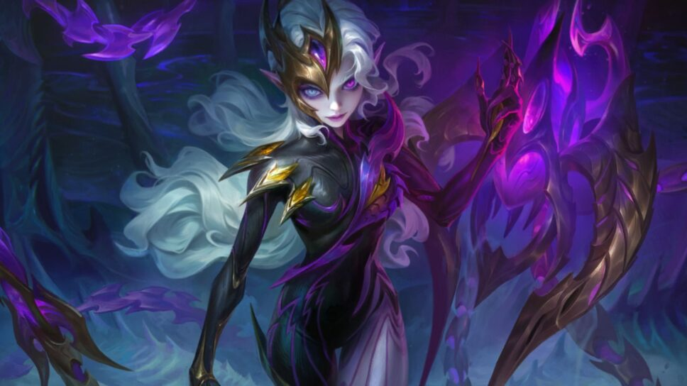

1. Foto Profil

Menampilkan foto profil berbentuk lingkaran (rounded-full).

object-cover menjaga gambar tidak gepeng.

2. Info Profil

<h4 class="text-lg font-semibold">Alif_king_carbeat</h4>
<button>Edit profil</button>
<button>Lihat arsip</button>
<i class="bi bi-gear-fill"></i>

Nama pengguna ditampilkan besar & tebal.

Ada tombol Edit profil dan Lihat arsip.

Ikon gear ⚙ menggunakan Bootstrap Icons (bi bi-gear-fill).

3. Statistik Akun

12 kiriman

11 pengikut

2001 diikuti

Menampilkan jumlah kiriman, pengikut, dan mengikuti.

4. Bio

yang ngeklaim Mati

Bio singkat pemilik akun.

5. Highlight Story

  +

Baru

Lingkaran kosong dengan tanda + untuk menambah highlight baru.

6. Grid Postingan

  

    
  

  <!-- dst... -->

Menggunakan grid 3 kolom untuk menampilkan postingan foto.

Setiap gambar diatur supaya penuh kotak dan tidak gepeng dengan object-cover.

7. Tailwind CSS

Digunakan untuk styling cepat, contohnya:
flex, grid, items-center, justify-center → mengatur tata letak
rounded-full, rounded → membuat foto/gambar jadi bulat atau punya sudut melengkung
hover:bg-gray-200 → efek hover di tombol.

8. Bootstrap Icons

Dipakai hanya untuk ikon gear (bi bi-gear-fill).
Agar muncul, tambahkan link CDN berikut di <head>:

<link rel="stylesheet" href="https://cdn.jsdelivr.net/npm/bootstrap-icons/font/bootstrap-icons.css">