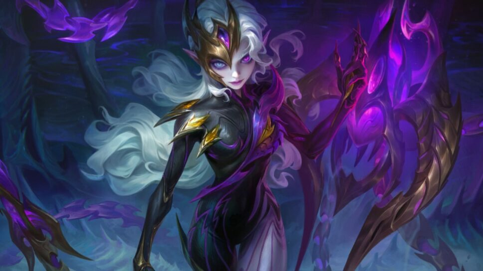

1. Setup Dasar
<!DOCTYPE html>
<html lang="id">
<head>
  <meta charset="UTF-8">
  <meta name="viewport" content="width=device-width, initial-scale=1.0">
  <title>Profil Instagram</title>

  <!-- Tailwind CSS CDN -->
  
</head>

<!DOCTYPE html> → mendefinisikan dokumen HTML5.
lang="id" → bahasa dokumen diatur ke Bahasa Indonesia.
meta viewport → agar layout responsif di perangkat mobile.
Tailwind CDN → menambahkan Tailwind CSS untuk styling instan.

2. Container Utama
<body class="bg-gray-100">
  

bg-gray-100 → memberi background abu-abu muda.
container mx-auto p-5 → konten berada di tengah (mx-auto) dengan padding 5.

3. Bagian Foto Profil + Info

flex items-center → membuat layout horizontal sejajar antara foto profil dan info akun.

📌 Foto Profil

  

w-1/4 → lebar 25% dari parent.
rounded-full → membuat foto jadi bulat.
object-cover → gambar proporsional.

📌 Info Profil

  

    <h4 class="text-lg font-semibold mr-3">Alif_king_carbeat</h4>
    <button class="border px-3 py-1 text-sm rounded mr-2 hover:bg-gray-200">Edit profil</button>
    <button class="border px-3 py-1 text-sm rounded hover:bg-gray-200">Lihat arsip</button>
    <i class="bi bi-gear-fill ml-3 text-xl"></i>
  

Nama profil tebal & besar.
Tombol Edit profil dan Lihat arsip dengan hover effect.

<i class="bi bi-gear-fill"> → ikon gear (Bootstrap Icons).

 Statistik

  
12 kiriman

  
11 pengikut

  
2001 diikuti

Menampilkan jumlah kiriman, pengikut, dan mengikuti.

yang ngeklaim Mati

Bio singkat pengguna.

4. Highlight Story

  

    +
  

Baru

Lingkaran dengan tanda + → untuk menambah highlight baru.
Label “Baru” ditaruh di bawahnya.

5. Grid Postingan

  <h5 class="mb-3 font-semibold">Postingan</h5>
  

grid grid-cols-3 gap-2 → layout grid 3 kolom, ada jarak antar gambar.

Setiap Postingan

  

aspect-video → menjaga rasio aspek.
w-full h-full object-cover → gambar menutupi kotak penuh.
rounded → sedikit melengkung di sudut.

Ada total 12 postingan: obsidian.jpg, gehenna.jpg, lillth.jpg, dunk.jpg, spinosaurus.jpg, grimlock.avif, batmanwh.avif, batmanred.jpg, batmandrk.jpg, natsumi.jpg, kurumi.jpg, nia.jpg.

Teknologi yang Dipakai
HTML5 → struktur dokumen.
Tailwind CSS → styling utility-based.
Bootstrap Icons → ikon gear (⚙).

Cara Menjalankan
Simpan file ini sebagai index.html.
Letakkan semua gambar (Karbit.jpg, obsidian.jpg, dst) di folder yang sama.
Tambahkan CDN Bootstrap Icons di <head> agar ikon muncul:

<link rel="stylesheet" href="https://cdn.jsdelivr.net/npm/bootstrap-icons/font/bootstrap-icons.css">

Buka file di browser.